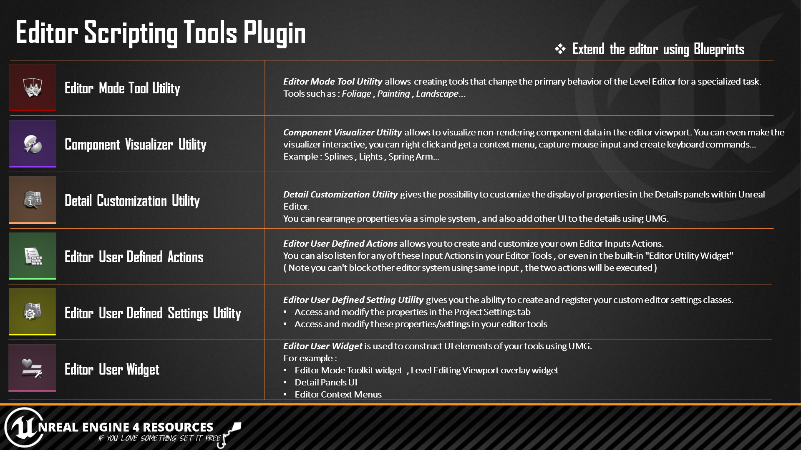
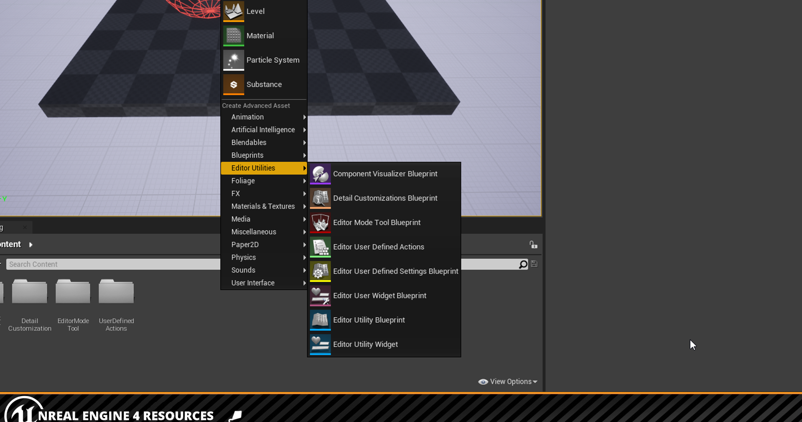
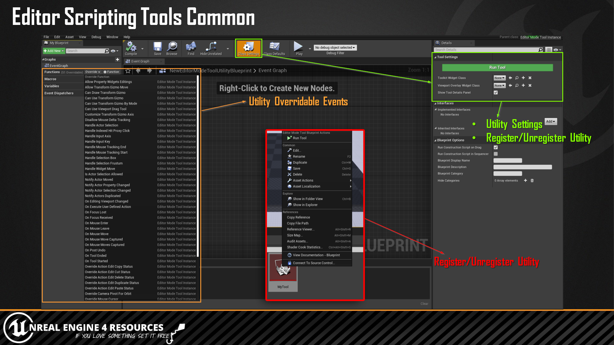

# To Download Examples project or Compiled plugin version
Visit https://unrealengineresources.com/plugins

# Editor Scripting Tools

## What is Editor Scripting Tools Plugin ?

Editor Scripting Tools is an ue4 editor plugin providing a set of tools and utilities allowing to extend and customize some parts the unreal editor using Blueprints.

## What are the current available Utilities and Features ?

- Editor Mode Tool Utility
- Component Visualizer Utility
- Detail Customization Utility
- User Defined Settings Utility
- User Defined Actions
- Editor User Widget
- User Defined Placement Categories

## Utilities Blueprints & Assets

## Utilities Common :

       
